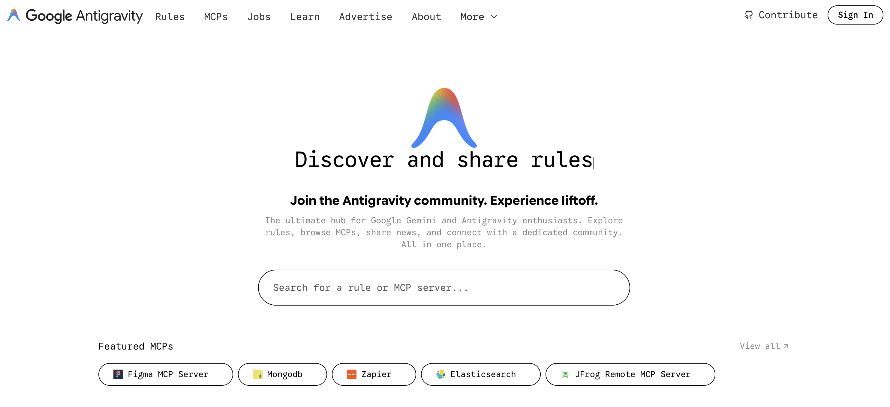

# @antigravity-rules/core

This repository contains the core collection of Cursor rules powering [antigravity.directory](https://antigravity.directory). 




These rules are designed to help developers configure their AI code editors (like Cursor) with best practices, framework-specific guidelines, and expert patterns.

## Where are these rules used?

All rules defined in this package are automatically published and made searchable on **[antigravity.directory](https://antigravity.directory)**.


Users can browse, copy, or install these rules directly into their `.cursorrules` file.

## How to Contribute

We welcome contributions! Whether you want to improve an existing rule or add support for a new language/framework, follow these steps:

### 1. Add or Edit a Rule File

Navigate to `src/rules/`.
- **Existing Rule:** Open the relevant file (e.g., `src/rules/typescript.ts`) and modify the content.
- **New Rule:** Create a new file (e.g., `src/rules/my-new-framework.ts`).

### 2. Follow the Rule Format

Each rule file should export an array of rule objects. Use the following structure:

```typescript
export const myNewFrameworkRules = [
  {
    tags: ["MyFramework", "Web", "JavaScript"],
    title: "MyFramework Best Practices",
    libs: ["my-framework-lib"],
    slug: "my-framework-best-practices",
    content: `
You are an expert in MyFramework. Follow these guidelines:

1. **Component Structure:** ...
2. **State Management:** ...
    `,
    author: {
      name: "Your Name",
      url: "https://twitter.com/yourhandle", // Optional
      avatar: "https://github.com/yourusername.png", // Optional
    },
  },
];
```

### 3. Export Your Rule

If you created a **new file**, you must export it in `src/index.ts` so it can be discovered.

```typescript
// src/index.ts
export * from "./rules/typescript";
export * from "./rules/python";
// ...
export * from "./rules/my-new-framework"; // Add this line
```

### 4. Submit a Pull Request

Push your changes and open a Pull Request. Once merged, your rules will be live on [antigravity.directory](https://antigravity.directory).

## License

MIT
